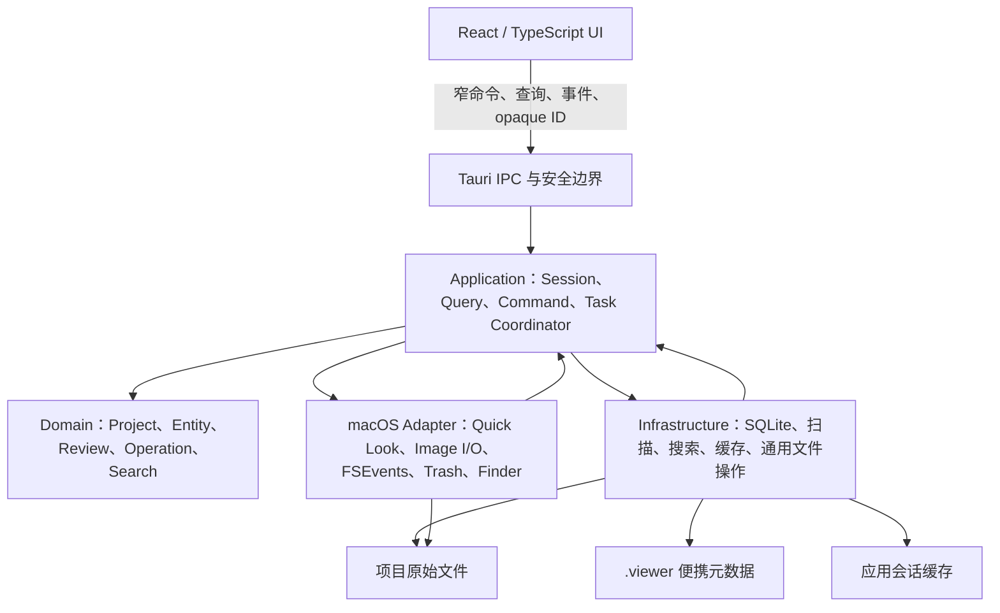

# Viewer 系统架构设计

> 状态：G1～G3 已验证，G4 冻结候选
> 日期：2026-07-16
> 适用版本：Viewer 0.1（macOS Apple Silicon）
> 关联文档：`docs/PRODUCT_SPEC.md`、`docs/TECHNICAL_FOUNDATIONS.md`、`docs/OPEN_SOURCE_RESEARCH.md`

## 1. 目的

本文定义 Viewer 0.1 的完整系统架构，包括模块边界、依赖方向、项目会话、任务调度、数据存储、文件身份、搜索与监听、图片处理、文件操作恢复、安全、错误和测试策略。

本文只冻结架构与行为契约，不展开具体界面视觉稿或逐任务实施计划。

## 2. 已确认的核心决策

1. Viewer 采用 **Tauri 2 + Rust + React/TypeScript + Vite**。
2. 整体架构采用**模块化单体**，不引入后台守护进程、本地服务器或微服务。
3. Rust Core 是项目、文件、索引、任务和文件操作状态的唯一业务权威。
4. React 只负责界面呈现、用户交互和局部视图状态，不直接读写用户文件。
5. 跨平台 Rust 核心从第一天与平台能力隔离；Viewer 0.1 只实现 macOS Adapter。
6. 原始素材始终保留在用户项目文件夹中，Viewer 不建立第二份完整素材库。
7. 项目便携元数据保存在项目根目录 `.viewer` 中；全文索引、缩略图和预览代理属于可抛弃的会话数据。
8. 缩略图优先使用 macOS Quick Look Thumbnailing；Image I/O 负责回退和高清预览，详见 [ADR 0001](../../adr/0001-macos-image-pipeline.md)。
9. 文件系统与 SQLite 之间通过持久操作日志实现可恢复的最终一致性，不宣称跨介质原子事务，详见 [ADR 0002](../../adr/0002-file-transaction-protocol.md)。
10. Viewer 0.1 按零网络依赖、无遥测和最小权限设计。
11. 扫描、会话索引、Unicode 搜索、generation 与 Watcher 协作采用 [ADR 0003](../../adr/0003-scan-search-and-generation.md) 的验证结果。

## 3. 架构原则

### 3.1 单一事实来源

- 原始文件内容以当前项目文件系统为事实来源。
- 便携标记和操作恢复状态以 `.viewer/metadata.sqlite` 为事实来源。
- 当前项目会话、任务和查询状态以 Rust Application 层为事实来源。
- React 中的列表、进度和预览状态均是 Rust 状态的投影，可通过重新查询快照恢复。

### 3.2 依赖倒置

Domain 不依赖 Tauri、SQLite、React 或 macOS 框架。Application 定义用例和平台端口，Infrastructure 与 Platform Adapter 实现端口，`src-tauri` 负责最终装配。

### 3.3 渐进加载

目录与基础文件信息先于缩略图、全文索引和内容指纹出现。任何后台派生任务都不能阻塞目录树与当前文件夹的首次可操作状态。

### 3.4 有界资源

扫描、解码、指纹、索引和预载均使用有界队列。图片内存预算依据解码像素计算，而不是依据压缩文件大小计算。

### 3.5 可恢复而非假设原子

批量文件操作允许部分成功。每个文件项独立记录状态，崩溃后根据操作日志和磁盘真实情况恢复或报告冲突。

## 4. 总体架构



图中的双向调用表示运行时协作，不改变编译期依赖方向：Adapter 依赖 Application 定义的端口，Application 不依赖具体 Adapter 类型。

## 5. 物理代码结构

目标仓库结构：

```text
Viewer/
├── ui/                              # React + TypeScript + Vite
├── src-tauri/                       # Tauri composition root、IPC、权限与打包
├── crates/
│   ├── viewer-domain/               # 纯领域模型与状态机
│   ├── viewer-application/          # 用例、Session、任务调度与端口 traits
│   ├── viewer-infrastructure/       # SQLite、扫描、搜索、缓存、通用文件操作
│   ├── viewer-platform-macos/       # Quick Look、Image I/O、FSEvents、Trash、Finder
│   └── viewer-test-support/         # 测试项目、故障注入和样本工具
├── docs/
│   └── adr/                         # 架构决策记录
└── tests/
    └── fixtures/                    # 图片、文本、目录和冲突样本
```

未来 Windows 版本增加 `viewer-platform-windows`，复用 Domain、Application 和大部分 Infrastructure。

不为每个小功能建立独立 crate。形成 crate 的理由只能是依赖方向、平台隔离、复用边界或测试隔离。

## 6. 模块职责

### 6.1 React UI

负责：

- 空白导入页、文件夹树、内容工作区、文本区、预览与对比工作区。
- 当前焦点、滚动位置、面板尺寸、临时选区和交互状态。
- 向 Rust 发出结构化命令和查询。
- 接收任务进度和项目增量事件；事件丢失时重新获取快照。

禁止：

- 直接访问任意文件路径或数据库。
- 保存项目业务状态的唯一副本。
- 通过 IPC 请求或接收完整图片 Base64、大型 JSON 字节数组。

### 6.2 Tauri Composition Root

负责：

- 初始化 Rust 模块、数据库连接、任务执行器和 macOS Adapter。
- 管理窗口生命周期、Tauri capabilities、CSP 和受限本地图片协议。
- 把 IPC DTO 转换为 Application 命令和查询。
- 把内部错误转换为稳定的 IPC 错误结构。

该层不得包含文件身份、审阅状态或文件事务规则。

### 6.3 Application

包含四类主要服务：

- `ProjectSessionService`：项目打开、关闭、只读降级和恢复检查。
- `QueryService`：目录、文件、搜索、筛选、排序和分页查询。
- `CommandService`：标记、收藏、重命名、移动、复制、废纸篓和撤销。
- `TaskCoordinator`：任务优先级、取消、进度、背压和 generation 管理。

Application 同时定义数据库、扫描、搜索、图片、Watcher、Trash、缓存和文件系统操作端口。

### 6.4 Domain

核心模型包括：

- `ProjectId`、`SessionId`、`EntityId`、`TaskId`、`OperationId`。
- 项目、文件夹、文件、审阅状态、收藏状态和相对路径。
- 文件操作计划、冲突策略、操作状态机和撤销计划。
- 搜索查询、范围、过滤器、排序和命中结果。
- 图片表现请求、解码预算和资源降级结果。

Domain 中的规则必须可以在不启动 Tauri、数据库和真实文件系统的情况下测试。

### 6.5 Infrastructure

负责：

- 递归扫描、路径规范化后的索引更新和目录统计。
- `.viewer/metadata.sqlite` 与会话索引数据库。
- FTS5 正文搜索和文件名/路径模糊匹配。
- 会话缓存、缓存键和失效处理。
- 与平台无关的复制流、校验、批量操作编排和操作日志仓储。

### 6.6 macOS Adapter

负责：

- `QLThumbnailGenerator` 缩略图请求和取消。
- Image I/O、Core Graphics、ColorSync 图片探测、降采样和高清预览。
- FSEvents/`notify` 文件系统事件接入。
- macOS 废纸篓、Finder 打开/导出和系统文件 ID。
- macOS 文件系统大小写规则、卷标识和原子重命名能力探测。

## 7. 项目会话

### 7.1 状态机

```text
EMPTY → OPENING → ACTIVE_READ_WRITE ┐
                 ↘ ACTIVE_READ_ONLY ├→ CLOSING → EMPTY
OPENING 失败 ────────────────────────┘
```

- 应用每次启动进入 `EMPTY`，不恢复上次项目。
- 一个进程同时最多存在一个项目会话。
- 项目可读但不可写时进入只读模式；浏览、预览、搜索和可读取的已有标记仍可用，文件操作和标记写入禁用。若项目没有可读取的 `.viewer`，本次会话使用临时项目身份且不提供持久标记。
- 关闭主窗口或退出应用进入 `CLOSING`，停止接收新项目命令。

### 7.2 打开顺序

1. 规范化根路径，验证目录、权限和安全边界。
2. 尝试打开或创建 `.viewer/project.json` 与 `metadata.sqlite`；只有读取权限时按只读规则继续。
3. 检查 schema、数据库完整性和未完成操作日志。
4. 快速扫描目录和文件基础信息。
5. 发布目录树与当前目录占位内容，使首屏可操作。
6. 调度可见缩略图、当前预览、文本索引和内容指纹。

完整指纹、全部缩略图、全文索引和非可见目录统计不得阻塞第 5 步。

### 7.3 关闭顺序

1. 停止接收新命令。
2. 取消可取消的扫描、缩略图、索引和预载任务。
3. 等待正在提交的便携元数据短事务完成。
4. 停止 Watcher，关闭数据库和图片资源。
5. 删除本次会话缓存；删除可在空白导入页出现后继续执行。

已完成的文件操作不会因关闭项目而回滚。

## 8. 任务调度

### 8.1 执行通道

- 文件变更通道：一个批量文件操作写任务串行执行，避免相互覆盖。
- 数据库写通道：便携元数据单写入者；会话索引批量写入。
- I/O 读取池：扫描、文本读取、复制和指纹读取，有界并发。
- 图片解码池：缩略图、代理和原图解码，与普通 I/O 并发分离。
- UI 通知通道：合并高频进度，不以每个文件事件刷新整个界面。

文件操作具有最高一致性优先级，但长时间复制不得占满图片解码和 UI 通知资源。

### 8.2 优先级

| 优先级 | 任务 |
| --- | --- |
| P0 | 文件操作控制、元数据提交、崩溃恢复；由串行写通道保护，不进入 G3 的可丢弃任务队列 |
| P1 | 用户主动搜索与目录发布；每类队列容量 8 |
| P2 | 当前高清预览、视口内缩略图和对比图代理；容量 32 |
| P3 | 当前子树文本索引与相邻预载；容量 8 |
| P4 | 全项目指纹、非可见派生工作和缓存校验；容量 4 |

同一通道采用有界队列和加权公平调度，避免 P4 永久饥饿。

### 8.3 取消与过期

每个异步请求至少携带 `session_id`、`generation` 和 cancellation token。

- 关闭项目时取消当前 session 的所有可取消任务。
- 切换目录或搜索词后取消旧请求。
- 已经无法取消但属于旧 generation 的结果可以完成资源清理，但不得写入当前界面或索引快照。
- 文件操作取消只阻止尚未开始的项目；已完成项目保留结果并进入摘要。

## 9. 数据分层

### 9.1 项目原始数据

JPG、PNG、Markdown 和 TXT 始终保留在用户项目目录中。Viewer 直接读取原文件，并直接对其执行用户确认的重命名、复制、移动和废纸篓操作。

### 9.2 便携项目元数据

```text
.viewer/
├── project.json
└── metadata.sqlite
```

`project.json` 保存项目 UUID、格式版本和创建信息。`metadata.sqlite` 概念上包含：

- `schema_migrations`
- `entities`
- `review_states`
- `operation_batches`
- `operation_items`

`entities` 保存稳定 `entity_id`、类型、相对路径、大小、修改时间、可用的平台文件 ID、快速指纹、内容指纹和 missing/tombstone 状态。

数据库策略：

- 单写入者。
- `journal_mode=DELETE`。
- `synchronous=FULL`。
- 外键开启，写入使用短事务。
- schema 迁移前生成同目录备份，迁移成功后保留最近一次备份。
- 打开时执行轻量完整性检查；无法安全读取时进入只读恢复流程，不静默覆盖。

便携数据库不保存缩略图、全文索引、原文或原图。

### 9.3 会话索引与缓存

每次项目打开创建独立 session 目录，包含：

- `session-index.sqlite`：目录、文件、统计和 FTS5。
- 缩略图文件。
- 视口尺寸预览代理。
- 可安全清理的图片、文本和查询派生数据。

会话数据库使用 WAL 和 `synchronous=NORMAL`。损坏时直接删除并重建。

会话缓存遵守当前产品约束：

- 退出或关闭主窗口后自动删除。
- 崩溃遗留在下次启动后台删除。
- 磁盘缓存上限 2 GB，按 LRU 淘汰。
- 剩余磁盘空间低于 5 GB 时停止新增磁盘缓存。
- 缓存清理不阻塞空白导入界面。

该策略以会话隐私和确定性为优先，代价是每次重新打开项目都需要重建缩略图和全文索引。

## 10. 文件身份

### 10.1 身份组成

- `entity_id`：Viewer 生成的稳定 UUID，用于标记和操作历史关联。
- 相对路径：项目跨电脑迁移后的首要匹配依据。
- 平台文件 ID：同一卷内外部重命名和移动的辅助依据，不用于跨电脑身份。
- 快速指纹：文件大小、修改时间和受控内容采样。
- 内容指纹：后台计算的完整内容哈希；复制时可在数据流中顺便计算。

### 10.2 匹配顺序

1. Viewer 内部操作直接沿用原 `entity_id`。
2. 重新打开或跨电脑迁移时按相对路径匹配。
3. 相对路径消失时，使用同一卷平台文件 ID 尝试恢复。
4. 未匹配项使用内容指纹在合理候选范围内恢复。
5. 多个候选无法唯一判断时不自动合并，生成恢复冲突。

路径未变但内容被外部修改时，默认保留该路径实体的标记，并更新指纹与派生数据。

## 11. 扫描与文件监听

### 11.1 扫描

扫描流程：

1. 遍历当前项目根目录。
2. 规范化路径，验证仍位于根目录内。
3. 忽略 `.viewer`、符号链接文件、符号链接目录和 macOS Alias。
4. 先发布目录，再收集文件基础属性。
5. 批量写入会话索引。
6. 根据当前视口和任务优先级派生缩略图、文本和指纹任务。

扫描器不把单文件错误升级为全项目失败。

### 11.2 Watcher

Watcher 事件不是最终事实，只是增量重扫提示：

1. 接收 FSEvents/`notify` 事件。
2. 在短时间窗口内归并连续写入、重复事件和临时文件变化。
3. 重新验证路径与根边界。
4. 与文件操作模块的 expected-change ledger 匹配，识别 Viewer 自身操作。
5. 重扫受影响目录并比较真实磁盘状态。
6. 使旧缩略图、预览代理、文本索引和统计失效。
7. 发布结构化增量事件。

事件溢出时先重扫已知范围；无法确定范围时才执行全项目重扫。

## 12. 搜索

### 12.1 查询模型

查询包含：

- 关键词。
- 全项目或当前子树范围。
- 文件类型、标记、收藏和其他筛选项。
- 排序方式。
- session 与 generation。

### 12.2 实现

- 文件名与相对路径使用 `nucleo-matcher` 进行 Unicode 模糊匹配。
- Markdown/TXT 正文使用 SQLite FTS5 trigram tokenizer。
- 1～2 个 Unicode 字符的正文查询在 SQL 范围/类型/标记/收藏过滤后最多线性检查 2,000 个文本实体，避免 trigram 短查询缺口并保持资源有界。
- 超过 10 MB 的 Markdown/TXT 不进入正文索引，只参与名称、路径和属性搜索。

### 12.3 排序

默认相关性顺序：

1. 文件名完整匹配。
2. 文件名前缀或高分模糊匹配。
3. 相对路径匹配。
4. 正文匹配。

同级结果再使用用户选择的名称、时间或大小规则稳定排序。结果分页返回，并标明命中字段。

## 13. 图片处理

### 13.1 原则

- 高清预览直接读取项目中的原始文件，不复制完整原图。
- 缩略图、解码内存和视口代理属于可重建表现。
- 前端不通过 JSON/Base64 IPC 接收完整图片数据。
- 单文件解码失败不得中断目录扫描或其他图片任务。

### 13.2 图片探测

读取图片头部并获得格式、像素尺寸、EXIF Orientation、ICC profile、alpha 和解码风险。探测先于完整解码。

超过 1 亿像素的图片禁止完整 100% 解码；更小图片仍需通过动态内存预算判断。

### 13.3 网格缩略图

1. 按单元格尺寸乘显示 scale 构建 Quick Look 请求。
2. 优先请求 `QLThumbnailGenerator` 的 raw、无装饰表现并支持取消；发布前统一处理方向并编码为会话 PNG 表现。
3. Quick Look 失败、质量异常或验证不一致时回退 Image I/O。
4. 只调度视口内项目和小范围 overscan，不为所有图片同时创建解码任务。
5. 缩略图完整适配统一单元格，不裁切原始内容。

Quick Look 与 Image I/O 必须通过 ICC、Display P3、EXIF 旋转和透明 PNG 样本验证。若两条路径在网格与高清预览间产生可见色彩或方向差异，Viewer 0.1 的 JPG/PNG 缩略图统一改用 Image I/O。

### 13.4 高清适窗预览

- Image I/O 直接从原始文件 URL 读取。
- 根据视口像素尺寸、显示 scale 和当前缩放生成降采样代理。
- 保留 EXIF 方向和 ICC 色彩信息。
- 切换图片或缩放级别后取消旧请求；旧结果不得覆盖新预览。

### 13.5 100% 与多图对比

- 完整解码前计算 `width × height × bytes_per_pixel`。
- 只有在当前内存预算允许时才创建完整解码表现。
- 2～4 图对比默认分别使用视口代理，禁止无条件同时解码四张完整原图。
- 内存压力升高时依次停止预载、降低解码并发、释放不可见代理，再降级当前表现并显示说明。

### 13.6 结果交付

React 获得 opaque entity ID 和当前 session 有效的受限本地协议 URL。原始项目路径只在生成会话表现时经过根边界验证；协议处理器只解析已登记的缓存表现，并必须验证：

- session token。
- opaque token 属于当前 session 的登记表。
- 请求的是允许的图片 MIME 和表现类型。
- 目标不是 `.viewer` 内部文件或符号链接。

缓存键至少包含项目 UUID、相对路径、文件大小、修改时间、请求像素尺寸、显示 scale、表现类型和渲染版本。

## 14. 文件操作与崩溃恢复

### 14.1 操作状态机

```text
PREPARED
  → STAGED
  → FS_APPLIED
  → VERIFIED
  → META_COMMITTED
  → INDEX_SYNCED
  → COMPLETED
```

关键状态变化写入 `operation_items`。批量任务由 `operation_batches` 聚合，但每项独立记录成功、跳过或失败。

### 14.2 预演

执行前验证：

- 源身份和当前存在性。
- 目标位于项目根内且不是 `.viewer`。
- 目标目录权限和卷信息。
- 同名冲突、大小写冲突和批量内部冲突。
- 批量重命名中的空名、非法字符、重复目标和循环关系。

### 14.3 操作协议

#### 同卷重命名与移动

使用平台原子 rename，随后验证文件身份并提交相对路径。是否同卷以文件系统设备/卷标识判断，不以路径字符串推测。

#### 复制

1. 在目标目录创建 Viewer 专用、不会进入索引的隐藏临时文件。
2. 使用 1 MiB 缓冲区流式复制并计算 BLAKE3 大小/哈希证据。
3. 刷新数据，验证大小和指纹。
4. 使用 Darwin `renamex_np(..., RENAME_EXCL)` 将临时文件无覆盖地原子重命名为最终名称。
5. 提交实体和索引。

崩溃遗留临时文件通过操作日志识别和清理，不误删未知用户文件。

#### 跨卷移动

按完整复制协议建立并验证目标，然后将源文件移入系统废纸篓。任一步失败均保留可恢复状态和明确结果。

#### 删除

只调用系统废纸篓，不提供永久删除。实体转为 missing/tombstone，以便用户从系统废纸篓恢复后重新关联标记。

### 14.4 冲突策略

- 跳过：源与现有目标均不改变。
- 保留两者：生成无冲突的新名称，执行前展示。
- 替换：现有目标先移入系统废纸篓，再放置新目标；禁止静默覆盖。

用户可以把选择应用于本批次剩余冲突。替换导致的废纸篓操作不进入 Viewer 撤销历史。

### 14.5 批量与取消

- 批量操作先统一预演，再逐项执行。
- 成功项不会因为其他项失败而错误回滚。
- 取消停止尚未开始的项目；已经完成的项目保留。
- 正在复制的项目在安全取消后清理已登记的临时文件。
- 批量重命名循环先把相关源改为唯一中间名，再改为最终名。

### 14.6 撤销

撤销是新的反向操作，而不是数据库回滚：

- 支持标记、收藏、重命名和项目内移动。
- 一个批量操作表现为一个撤销步骤，底层仍逐项验证。
- 撤销前重新验证路径、目标和文件身份。
- 复制和废纸篓操作不由 Viewer 撤销。
- 撤销历史仅存在当前项目会话。

### 14.7 Watcher 协作

文件操作开始前登记 expected changes。Watcher 使用路径、文件身份、时间窗口和预期结果匹配 Viewer 自身产生的事件，但任务结束后仍重扫受影响目录，以磁盘状态完成最终校验。

### 14.8 崩溃恢复

项目打开时，在进入 ACTIVE 前检查未完成操作：

1. 读取最后持久状态。
2. 检查源、临时目标和最终目标的路径、大小、文件 ID 和指纹。
3. 对唯一安全的情况补交元数据、完成最终 rename 或清理临时文件。
4. 无法唯一判断时停止自动处理，保留文件并生成恢复报告。

恢复逻辑宁可留下可解释的重复文件，也不能猜测性删除用户数据。

## 15. 安全边界

### 15.1 IPC 与权限

只暴露 Viewer 自有窄域命令，例如：

- `open_project`
- `close_project`
- `query_folder`
- `search`
- `request_image_representation`
- `set_review_state`
- `rename_items`
- `copy_items`
- `move_items`
- `trash_items`
- `undo_last_operation`

React 不获得宽泛的 Tauri filesystem、shell、HTTP 或数据库权限。

### 15.2 路径

每次扫描、预览、Markdown 资源解析和文件操作都必须重新规范化路径并验证根边界。`.viewer` 为保留目录，不允许通过普通文件操作进入。首版不跟随符号链接和 macOS Alias。

### 15.3 Markdown/TXT

- Markdown 生成的 HTML 通过 Rust 侧 `ammonia` 显式元素/属性允许列表净化。
- 禁止脚本、内联事件、远程图片、远程样式和自动网络请求。
- 相对资源接受与普通文件相同的根边界验证。
- 外部链接只有用户点击后才交给系统默认浏览器。

### 15.4 网络与诊断

- 不登录、不更新检查、不遥测、不自动崩溃上传。
- 严格 CSP 禁止远程源和任意 WebView 导航。
- 日志不保存文件正文、图片数据或不必要的完整绝对路径。
- 诊断导出只能由用户主动触发。

## 16. 错误模型

内部错误分类：

- `Validation`：非法名称、越界路径、无效操作。
- `Conflict`：同名、身份变化、外部修改。
- `Environment`：权限、只读磁盘、空间不足、文件被占用。
- `Content`：损坏图片、文本编码异常、超大文件。
- `Consistency`：未完成事务、索引不一致、数据库恢复。
- `Internal`：未预期程序错误。

跨 IPC 错误至少包含：

```text
code
category
user_message
retryable
task_id?
item_id?
```

Rust 调试字符串、堆栈和原始系统路径不得直接显示给用户。批量错误以任务摘要加逐项结果呈现。

## 17. 性能与资源预算

标准设备：MacBook Air、Apple M4 10 核 CPU、24 GB 内存、本机 SSD。

| 指标 | Viewer 0.1 目标 |
| --- | --- |
| 冷启动至空白界面 | ≤ 1 秒 |
| 导入后目录树首次可操作 | ≤ 1.5 秒 |
| 基础元数据扫描 | ≤ 3 秒 |
| 已索引搜索响应 | ≤ 100 毫秒 |
| 已加载目录切换 | ≤ 100 毫秒 |
| 约 10 MB 图片首次预览 | ≤ 800 毫秒 |
| 稳态内存 | ≤ 500 MB |
| 短时峰值内存 | ≤ 700 MB |

验收报告同时记录 p50、p95、样本数量、冷/热定义、图片像素尺寸和格式。文件压缩大小不能代替解码内存指标。

这些性能数字只对标准设备和标准测试项目负责；其他 Apple Silicon 设备只声明功能兼容，未经测试不声明相同性能。

## 18. 测试策略

### 18.1 单元测试

- 路径根边界和保留目录。
- 文件身份匹配与多候选冲突。
- 标记、收藏和操作状态机。
- 批量重命名计划和循环。
- 任务优先级、取消和 generation。
- 搜索范围、过滤和排序。
- 图片解码预算。

### 18.2 集成测试

- 临时文件系统中的扫描、复制、移动、重命名和删除。
- SQLite schema migration、完整性检查和恢复。
- Watcher 事件归并和 expected changes。
- FTS5 中文正文、短查询和超大文本。
- Quick Look/Image I/O 的缩略图与预览。

### 18.3 故障注入

- 在文件操作每个持久状态后强制终止。
- 磁盘空间不足、权限变化和目标被占用。
- 图片或文本写入一半时触发 Watcher。
- 数据库损坏、临时文件遗留和事件溢出。

### 18.4 端到端与性能

- 使用用户提供的真实项目文件夹。
- 覆盖导入、浏览、搜索、标记、对比和所有文件操作。
- 覆盖长时间连续浏览、快速切图和内存压力。
- 记录 p50/p95 和内存峰值。

0.1 不设置 5000 张图片压力门槛，但测试样本必须覆盖：

- 大尺寸 JPG 和透明 PNG。
- sRGB、Display P3 和其他 ICC profile。
- 各种 EXIF Orientation。
- 损坏、截断和尚未写完的图片。
- UTF-8、带 BOM 和可识别的常见文本编码异常。
- 深目录、重复文件名、大小写冲突和批量重命名循环。

## 19. 架构验证闸门

正式展开全部功能开发前完成四个内部闸门：

### G1 图片原型

验证 Quick Look、Image I/O、ICC、EXIF、受限本地 URL、快速切图、2～4 图对比和内存预算。失败时优先统一为 Image I/O；仍失败才评估原生 AppKit/Metal 预览面板。

### G2 文件事务原型

验证复制临时文件、指纹校验、循环重命名、同名替换、系统废纸篓和每个状态点的崩溃恢复。

### G3 扫描搜索原型

验证渐进目录树、FTS5 中文、短查询、文件名模糊匹配、任务取消和旧 generation 结果丢弃。

### G4 架构冻结

汇总 G1～G3 的性能与异常证据，确认直接依赖许可证、Tauri 权限/CSP、模块接口和 ADR。冻结结果记录于 [ADR 0004](../../adr/0004-viewer-0.1-architecture-freeze.md) 和 [跨 crate API 基线](../../architecture/viewer-0.1-api-baseline.md)。只有 ADR 0004 接受后才开始 M1。

这些原型使用最小验证界面即可，不需要向用户提供阶段性测试包。

## 20. 关键取舍

### 20.1 为什么选择模块化单体

Viewer 只处理单机、单项目和千张量级素材。单体进程减少部署、IPC、故障恢复和调试复杂度，同时通过 Rust crate 与端口保持清晰边界。

### 20.2 为什么首版仍隔离 Windows

从第一天隔离平台能力会增加少量接口设计成本，但可以避免扫描、文件事务、搜索和标记逻辑与 macOS API 绑定。Windows 版本只需新增平台 Adapter 和平台验收。

### 20.3 为什么不直接读取 Finder 缩略图缓存

Finder 的私有缓存不是稳定公共接口。Viewer 通过公开的 `QLThumbnailGenerator` 请求系统缩略图，并保留 Image I/O 回退与一致性验证。

### 20.4 为什么退出清缓存

这是已经确认的产品约束。架构明确接受重复打开项目时重建缩略图和全文索引的性能成本，并通过渐进加载保证首屏可用。

### 20.5 为什么不承诺跨文件系统原子事务

文件系统操作、SQLite 和系统废纸篓无法共享单一原子提交。Viewer 选择可持久化状态机、验证和恢复报告，优先保证用户数据不被猜测性删除。

## 21. 完成定义

本架构设计在以下条件下视为实现完成：

- 代码依赖方向与第 5、6 节一致。
- 四个架构闸门均有可复现证据。
- 文件操作故障注入测试全部通过。
- 图片色彩、方向和内存策略通过样本验证。
- 产品规格中的 Viewer 0.1 功能与性能验收通过。
- 构建产物无网络、遥测或未授权文件系统能力。
- `.viewer` 元数据在项目复制到另一台电脑后可以恢复标记。
