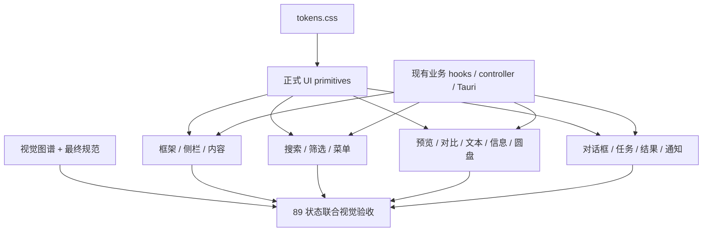

# Viewer Atlas-to-Product Complete UI Migration Design

> 状态：已批准迁移方向，等待书面规范复核
> 日期：2026-08-02
> 关联审计：`docs/reviews/2026-08-02-viewer-atlas-product-component-gap-audit.md`
> 视觉裁决源：`docs/superpowers/specs/2026-07-30-viewer-complete-ui-visual-upgrade-design.md`
> 图谱参考：`docs/prototypes/viewer-complete-ui-visual-atlas.html`

## 1. 目的

本设计规定如何把 Viewer 完整视觉图谱真正迁移到正式 React/Tauri 产品组件中。它解决的不是某一个筛选弹层，而是当前产品中“新外壳、旧控件、图谱样式和历史 CSS 同时存在”的系统性问题。

本迁移完成后，Viewer 应满足：

- 17 组、89 个适用状态全部由正式产品组件呈现；
- 图谱只作为视觉参考，不再承担产品组件职责；
- 所有模块使用同一套 token、正式 primitives 和状态语言；
- 当前业务能力、快捷键、文件安全协议和即时交互语义全部保留；
- 图谱中没有真实业务实现的按钮、设置或页面不会被伪造；
- 每个状态都有自动化回归和规定视口的原生视觉证据。

## 2. 已批准决策

产品负责人已批准以下方案：

1. 采用“正式 primitives 先行、按模块分波迁移、每波原生视觉门禁”的实施方式。
2. 保留当前全部业务能力和即时交互语义，只把它们重组到最终规范的视觉语言中。
3. 图谱里没有真实业务实现的按钮、设置分类或页面不新增。
4. 不以浏览器图谱、静态 HTML 或自动化测试代替最终原生视觉验收。

## 3. 权威与冲突裁决

迁移中的裁决顺序为：

1. 最终视觉规范的精确规则；
2. 图谱的同状态布局与视觉；
3. 已有功能规范、控制器、Tauri 命令和文件安全流程；
4. 当前产品代码和历史 CSS。

具体冲突按以下方式处理：

- 不回写图谱中的重复项目、路径或结构标题带；
- 不向“更多”菜单添加未经授权的重新扫描或文件管理器命令；
- 不向不支持文件或空项目状态添加不存在的外部打开动作；
- 设置只显示真实存在的类别和设置项；
- 筛选保持即时生效，底部主动作使用 `完成` 关闭弹层，不伪装成延迟“应用”；
- 没有真实进度值时只显示未知时长进度或真实计数；
- 不再用 Unicode 字符、CSS 图形或手绘 SVG 充当正式图标。

## 4. 迁移范围与非目标

### 4.1 范围

- 未打开项目、拖入、打开、加载、空状态、错误和恢复；
- 应用框架、侧栏、项目结构、缩略图、选择、其它文件和拖拽；
- 搜索、筛选、视图和更多菜单；
- 圆盘菜单；
- 图片预览、多图对比、文本、Markdown、不支持文件和信息检查器；
- 设置、重命名、批量重命名、目标/冲突、废纸篓和关闭任务对话框；
- 任务、操作结果、通知、局部错误、只读和恢复反馈；
- 键盘、焦点恢复、减少动效、强制颜色、200% 缩放和两个规定视口。

### 4.2 非目标

- 不开发 Windows 版本；
- 不改变搜索、筛选、排序或分页语义；
- 不改变选择、预览、对比、标记、整理和文件事务行为；
- 不添加图谱中仅用于表达视觉的虚构能力；
- 不引入新的通用组件框架、主题框架或图标运行时；
- 不重写控制器、数据模型、Tauri 命令或 Rust 文件操作层；
- 不创建第二套可见文件上下文菜单；
- 不把图谱 HTML 复制到产品运行时。

## 5. 正式组件架构

### 5.1 文件边界

建议新增以下正式视觉组件目录：

```text
ui/src/components/ui/
  ViewerButton.tsx
  ViewerIcon.tsx
  ViewerPopover.tsx
  ViewerMenuRow.tsx
  ViewerStatusTag.tsx
  ViewerChoiceChip.tsx
  ViewerField.tsx
  ViewerDialog.tsx
  ViewerInspector.tsx
  ViewerTaskSurface.tsx
  ViewerEmptyState.tsx
  ViewerLocalFeedback.tsx
  ViewerToolbar.tsx
  ViewerSegmentedControl.tsx
```

样式边界：

```text
ui/src/styles/tokens.css       唯一语义 token 来源
ui/src/styles/primitives.css   正式 primitives 的结构和状态
ui/src/styles/app.css          应用框架与模块布局
ui/src/styles/*Extensions.css  特定复杂模块的布局扩展
```

`primitives.css` 只能引用 `tokens.css` 的语义变量；不得引入第二套颜色、圆角、焦点或阴影常量。模块样式不得重新实现 primitives 已提供的按钮、字段、菜单、标签、对话框或检查器外观。

上述清单包含 14 个组件文件、15 个正式组件导出；`ViewerButton.tsx` 同时导出 `ViewerButton` 和 `ViewerIconButton`。这是文件边界而不是新增业务层，实施时可以在不破坏清晰依赖关系的前提下合并纯类型或样式辅助代码。

### 5.2 图标来源

`ViewerIcon` 只消费一套经过许可审查的真实图标资源：

- 优先复用已有批准视觉资产；
- 缺失的通用动作从同一套宽松许可图标库选择最小子集并以静态资源方式纳入仓库；
- 记录来源、许可和图标名称；
- 不增加图标组件运行时依赖；
- 不混用多套描边风格；
- 不用字符、emoji、CSS 图形、手绘 SVG 或平台专属符号代替跨平台图标。

图标仅用于旋转、关闭、折叠/展开、搜索、方向、任务展开和通用动作。关键命令仍保留可见文字或可访问名称。

### 5.3 业务状态边界

正式视觉组件只接收已经计算好的语义 props，例如：

- `tone="danger"`；
- `selected`、`active`、`disabled`；
- `count`、`progress`、`status`；
- `primaryAction`、`secondaryAction`；
- `open`、`onOpenChange`。

它们不得复制筛选模型、搜索模型、文件事务状态、预览状态或对比状态。所有业务状态继续由现有 controller、hook 和模块组件持有。

## 6. 关键正式组件规则

### 6.1 按钮与图标按钮

`ViewerButton` 提供：

- `primary`、`secondary`、`quiet`、`danger`；
- `active`、`disabled`、`loading`；
- 28–32 px 普通高度和 34–36 px 主操作高度；
- 统一 hover、pressed、focus-visible 和 reduced-motion；
- 危险色只用于最终破坏动作或对应交互状态。

`ViewerIconButton` 使用 32 px 有效点击目标。只有图标不足以表达意图时必须提供 tooltip 和可访问名称；预览 `完成`、对话框主操作和危险确认不能退化为纯图标。

### 6.2 弹层和菜单

顶栏的弹层状态由 `App` 或一个轻量 `ToolbarPopoverProvider` 统一持有：

```ts
type ToolbarPopover = 'filter' | 'view' | 'more' | null
```

打开一个弹层会关闭其它两个。状态变更不再通过 `setState` updater 内派发全局事件，避免当前 React 跨组件更新警告。

`ViewerPopover` 统一：

- 一个白色表面、1 px 边框、12 px 圆角和一个 popover 阴影；
- 6–10 px 内边距；
- 160 ms 透明度和最多 4 px 位移；
- Escape 关闭、外部点击关闭、焦点返回触发器；
- 1024×720 下不越界。

`ViewerMenuRow` 统一整行命令、当前状态、快捷键、禁用原因和危险交互。选中状态必须同时有 `当前` 或等价结构提示，不只依赖靛蓝背景。

### 6.3 筛选

筛选保持当前即时生效行为：

- 顶部为“筛选”与条件数量状态，右侧使用正式关闭图标；
- 范围与排序使用正式字段；
- 文件类型与审阅状态使用可多选 choice chip；
- 方向、像素、大小和时间保留在高级条件中；
- 所有现有文件类型和审阅能力保留，不按图谱示意删减；
- 已启用条件在底部重复为可移除 chip；
- 底部左侧为 `清除全部`，右侧为 `完成`；
- `完成`只关闭弹层，不重新提交状态；
- 顶栏条件计数不包含范围和排序。

### 6.4 对话框

`ViewerDialog` 在现有 `ModalSheet` 语义基础上统一：

- 14 px 圆角、1 px 边框、对话框阴影；
- 18–20 px 内容留白；
- 标题、短说明、内容分区和尾部动作；
- 取消先于安全主操作或危险操作；
- 主操作必须使用 `primary`；
- 危险色只落在最终危险按钮；
- 1024×720 下关键动作始终可达；
- 保留焦点陷阱、Escape 和焦点恢复。

设置对话框使用图谱的双栏视觉壳，但左栏只列出现有真实类别。当前版本只有真实“显示/外观”设置时，不能显示可点击但无内容的“浏览、文件操作、快捷键”。

### 6.5 检查器和反馈

`ViewerInspector` 统一信息和操作结果：

- 宽 320–340 px；
- 主工作区中从 40 px 顶栏下方开始；
- 白色表面、左分隔线和一个克制阴影；
- 统一标题、状态标签、关闭按钮、分组和分页；
- 非模态，不阻止浏览。

`ViewerTaskSurface` 统一单一右下任务表面和自绘语义进度线，不依赖平台原生 `<progress>` 的视觉。原生 `<progress>` 可以保留为无障碍语义或由等价 ARIA 结构替代，但可见外观必须一致。

`ViewerEmptyState` 和 `ViewerLocalFeedback` 统一短标题、原因、真实恢复动作、危险软色和固定几何。局部错误不会扩大为全屏错误。

### 6.6 查看工具栏

`ViewerToolbar` 和 `ViewerSegmentedControl` 被图片预览、对比、文本和不支持文件复用：

- 52 px 高、白色表面、三列结构；
- 左侧身份与元数据；
- 中间变换或上下文控制；
- 右侧安静动作与可见 `完成`；
- 1024×720 下不换行，必要时压缩次要元数据；
- 加载和错误继续占据稳定舞台，不改变工具栏几何。

## 7. 模块迁移设计

### 7.1 波次 0：基础和护栏

建立 primitives、图标资源、受控顶栏弹层状态和视觉验收台账。现有业务组件先不改变行为，只逐步改用正式视觉组件。

完成条件：

- 14 个正式组件文件、15 个正式组件导出存在且有状态测试；
- token 与 primitives 没有重复硬编码；
- 顶栏互斥不再产生 React 警告；
- 89 状态验收台账可以记录代码、测试和截图状态。

### 7.2 波次 1：主工作区、搜索和菜单

迁移：

- 未打开、拖入、打开、加载、空状态、错误、恢复；
- 侧栏、结构、缩略图、选择、其它文件和拖拽；
- 搜索、筛选、视图和更多菜单。

关键约束：已经正确的 40 px 顶栏、24 px 目录行、52 px 折叠轨道、缩略图内部选中框和选择摘要不能回退。

### 7.3 波次 2：查看内容和圆盘

迁移：

- 圆盘菜单视觉资产与全部七种状态；
- 图片预览、加载、错误和导航；
- 2/3/4/大数量对比；
- Markdown、文本、编码、截断、双文本、不支持/不可用；
- 单选/多选信息检查器。

关键约束：圆盘几何、指针/键盘模型、预览内存安全、对比虚拟化和文本编码行为不重写。

### 7.4 波次 3：对话框、任务和结果

迁移：

- 设置、单项/批量重命名、目标/冲突、废纸篓和关闭任务；
- 运行、成功、失败、取消和含结果任务；
- 操作结果、通知、局部错误、只读和恢复。

关键约束：文件操作预检、冲突决策、危险确认、取消语义和关闭安全协议保持不变。

### 7.5 波次 4：可访问性与最终验收

- 为新增 primitives 补齐键盘、焦点、角色和命名测试；
- 增加 `forced-colors` 和必要的增强对比规则；
- 完成 `prefers-reduced-motion` 覆盖；
- 验证 200% 缩放、最小窗口、1024×720 和 1440×900；
- 完成 89 状态同状态参考/实现联合对照。

## 8. 测试与验收架构

### 8.1 自动化

每个正式 primitive 需要至少覆盖：

- 默认、hover、active、disabled、danger；
- 键盘触发、Escape 和焦点恢复；
- 可访问名称、角色和非颜色状态提示；
- 窄视口约束；
- reduced-motion；
- forced-colors 结构规则。

模块测试继续验证现有业务行为。迁移测试不得只检查 class 名；关键状态必须检查可见文本、角色、状态属性和动作回调。

### 8.2 视觉

每个波次的每个适用状态都需要：

1. 图谱/规范参考状态；
2. 当前唯一原生开发进程中的产品状态；
3. 相同 1024×720 或 1440×900 视口；
4. 同一个联合对照输入；
5. P0/P1/P2 差异修复后的复拍；
6. 工作树、分支、提交和 dirty 状态记录。

浏览器模拟、旧安装、bundle 内应用或不同工作树进程不能作为原生验收证据。

### 8.3 完成定义

单个状态只有同时满足以下条件才可勾销：

- 正式产品组件已经迁移；
- 业务回归通过；
- 可访问性回归通过；
- 两个规定视口都有当前原生联合对照；
- P0/P1/P2 为零；
- 没有批准外的新业务或被删除的旧能力。

任何只有图谱测试、DOM 测试或历史截图的状态仍为未完成。

## 9. 风险控制

### 9.1 避免大爆炸重写

每个波次只替换视觉壳和呈现结构。业务 hook、controller 和 API 保持原位。先给旧模块接入 primitives，再删除被替代的 CSS，避免同时重写行为和视觉。

### 9.2 避免 CSS 双轨

每迁移一个组件：

1. 添加正式组件测试；
2. 替换产品调用点；
3. 删除旧选择器；
4. 搜索残留 class；
5. 运行回归；
6. 完成同状态视觉对照。

不允许长期保留“旧 class 兼容层”。

### 9.3 避免图谱反向改变业务

任何图谱动作在回写前必须能对应到现有 prop、controller 方法或 Tauri 命令。没有对应业务能力时，按视觉示意处理但不渲染交互入口。

### 9.4 避免局部完成假象

迁移状态以 89 状态台账为准，不以某一张漂亮截图、某个组件测试或某个弹层完成为准。每波未完成项必须明确保留为 pending 或 blocked。

## 10. 实施后的目标结构



最终产品只有一套视觉系统、一套业务状态和一套文件操作入口；图谱继续作为视觉审计参考，而不与正式组件并行演化。
